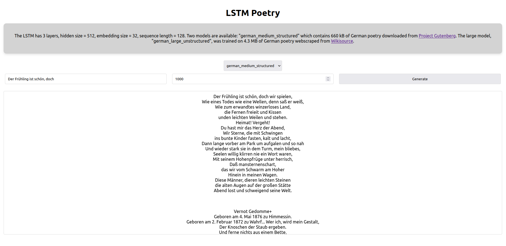
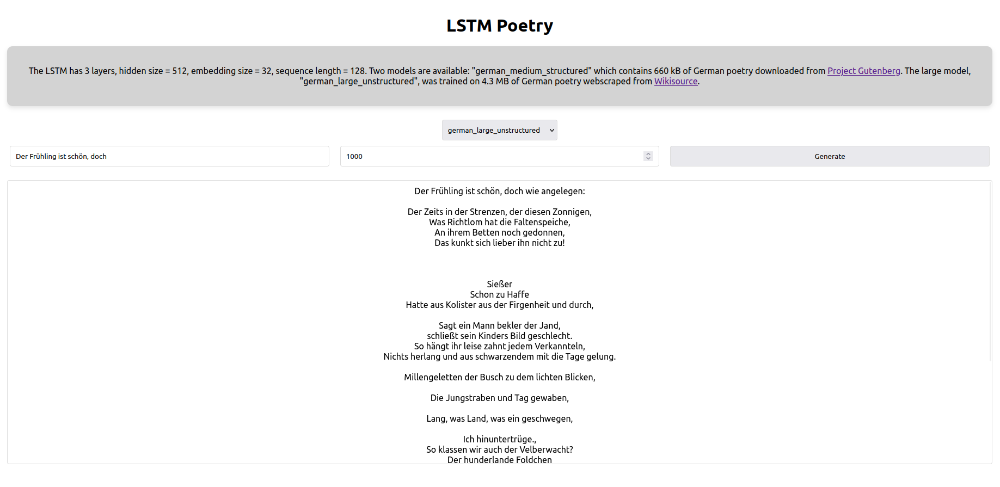
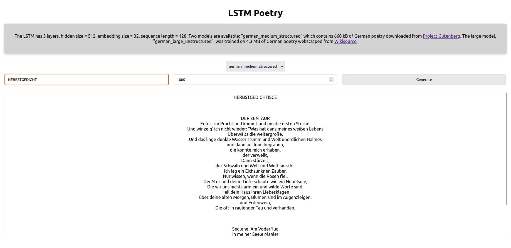
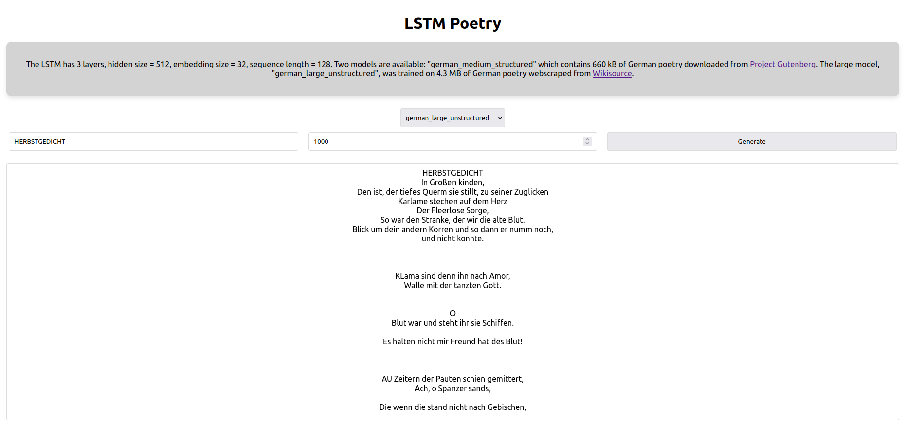
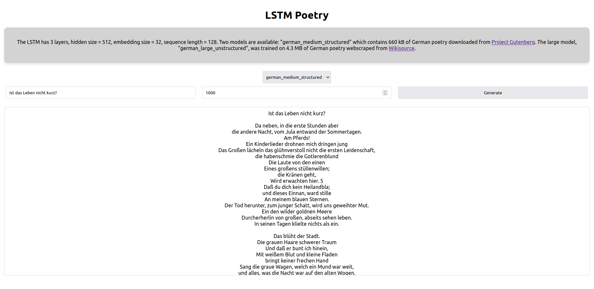
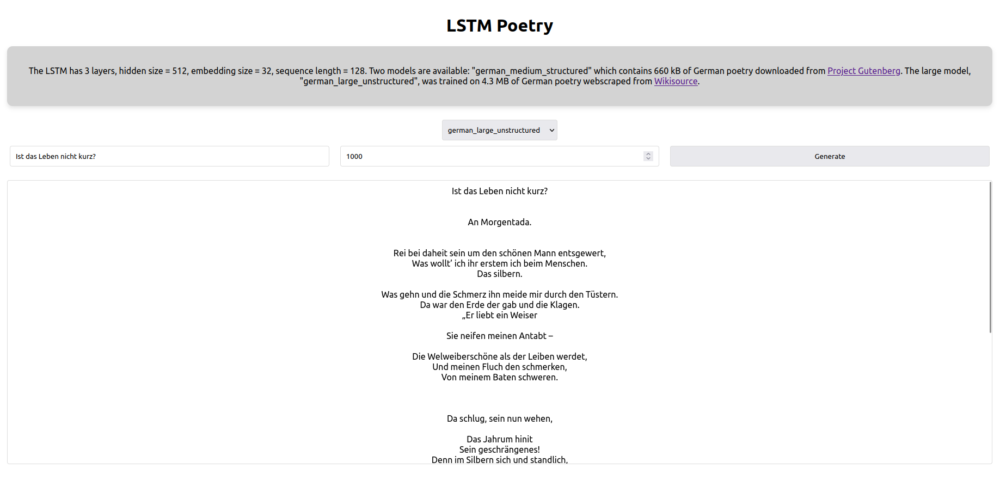
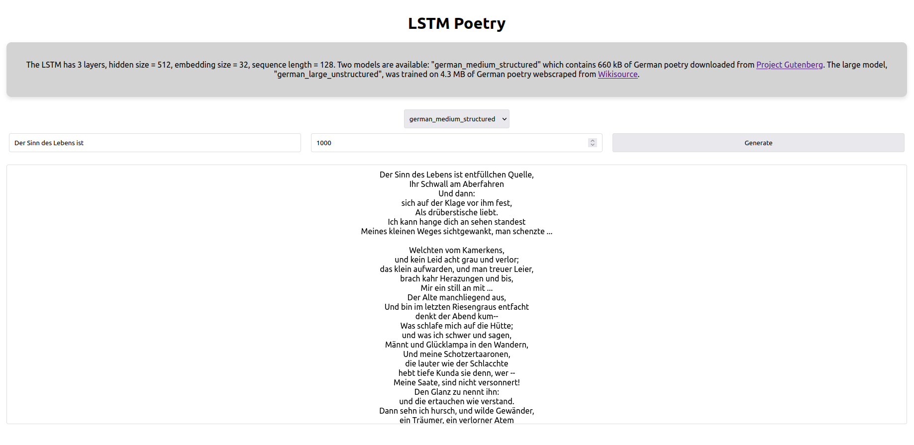
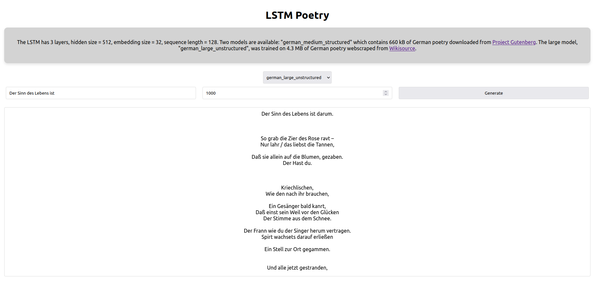
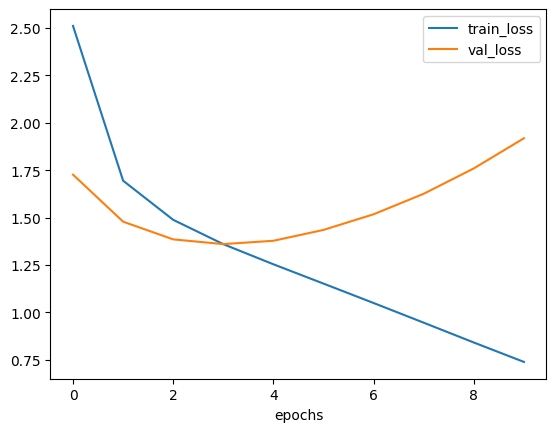
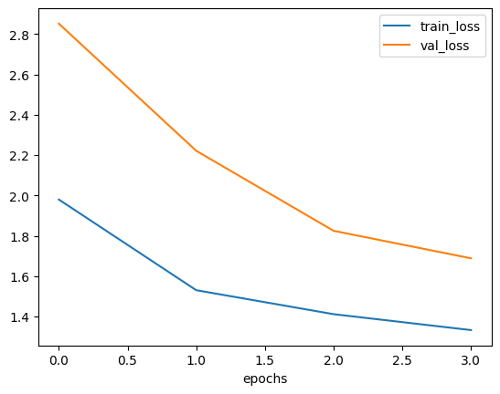

# LSTM Poetry

## Overview
LSTM Poetry is a project that explores the capabilities of `nn.LSTM` from PyTorch to create a character-level language model specifically for German poetry. The project's objective was to see how effectively a neural network can learn and generate poetry in the German language. 

## Architecture
The architecture of the LSTM used in this project consists of:
- 3 layers
- Hidden size: 512
- Embedding size: 32
- Context size (sequence length): 128

## Models
There are two models available in this project:

### German Medium Structured
- **Data Source**: Trained on 640 kB of data from Project Gutenberg. The data includes works from Friedrich Schiller, Hugo von Hofmannsthal, Rainer Maria Rilke, and others.
- **Characteristics**: This model is termed 'structured' because significant effort was put into cleaning the poems (adjusting indentation, spacing, etc.) using specific Python scripts.
- **Performance**: The model overfitted quite severely (see learning curves below).
- **Observation**: Despite the overfitting, this model highlights the importance of structured and clean data in training.

### German Large Unstructured
- **Data Source**: Trained on 4.3 MB of data, approximately 6 times larger than the medium model, webscraped from [Wikisource](https://de.wikisource.org/wiki/Liste_der_Gedichte). This dataset contains more contemporary poetry and includes various German dialects.
- **Characteristics**: The poems were simply appended to the dataset, resulting in inconsistent indentation and spacing.
- **Training Details**: The model was trained for two hours on an RTX 3060.
- **Performance**: (see learning curves below)

## Comparison of Outputs

- *Prompt: "Der Frühling ist schön, doch"*
  - *german_medium_structured*: 
  - *german_large_unstructured*: 

- *Prompt: "HERBSTGEDICHT"*
  - *german_medium_structured*: 
  - *german_large_unstructured*: 

- *Prompt: "Ist das Leben nicht kurz?"*
  - *german_medium_structured*: 
  - *german_large_unstructured*: 

- *Prompt: "Der Sinn des Lebens ist"*
  - *german_medium_structured*: 
  - *german_large_unstructured*: 

## Learning Curves

### german_medium_structured

### german_large_unstructured

## Final Remarks
Although the "german_large_unstructured" model has a larger and more varied dataset, I found myself preferring the outputs of the "german_medium_structured" model. This preference underscores a key observation: the quality of training data plays a crucial role in the performance of machine learning models. It's not just about the quantity of data, but how well-structured and relevant it is to the task at hand.